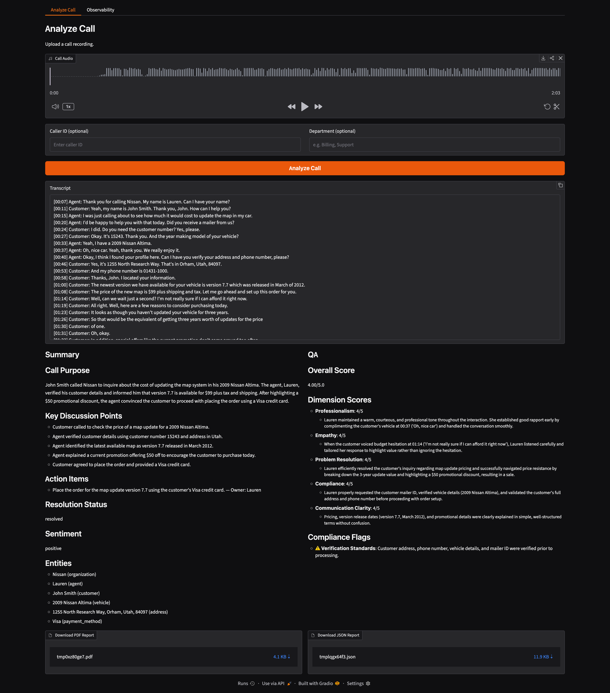
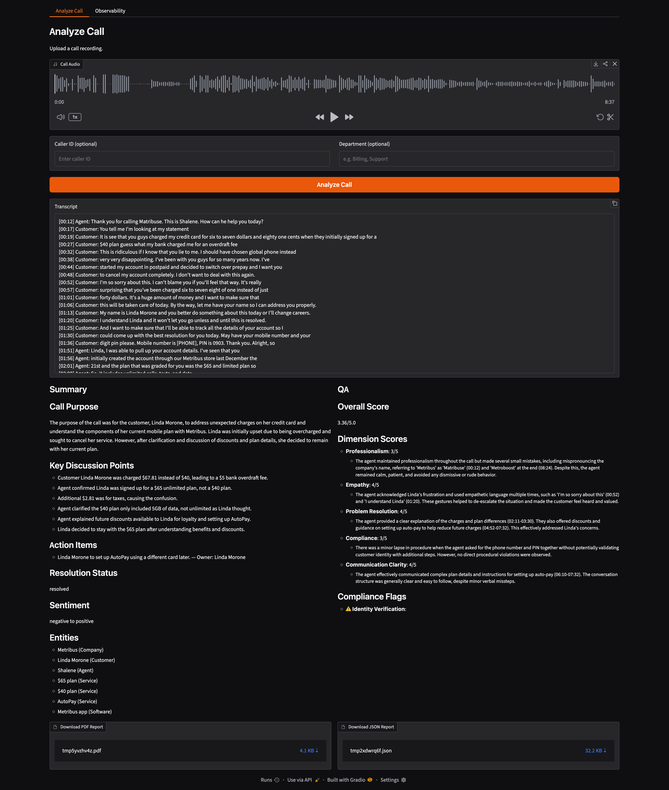
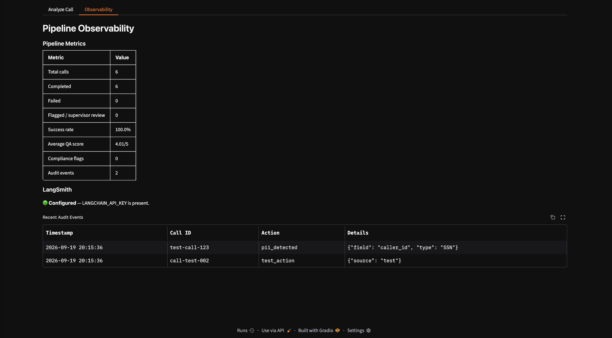

# Call Center Intelligence

An AI-powered call center intelligence application that transforms call recordings into structured, actionable insights.

The application transcribes calls, identifies Agent/Customer dialogue, detects PII and prompt injection, generates summaries, scores agent performance, and produces PDF/JSON reports.

---

## Features

* 🎙️ Upload call audio through Gradio
* 📝 Local speech-to-text using `faster-whisper`
* 🗣️ Agent / Customer speaker labeling
* ⏱️ Timestamped transcription segments
* 📊 Transcription confidence scoring
* 🧹 Transcript cleanup
* 🔐 PII detection and redaction
* 🛡️ Prompt injection detection
* 🧠 LLM-powered call summarization
* ⭐ QA scoring across multiple dimensions
* 🚩 Compliance flag detection
* 📄 PDF and JSON report generation
* 💾 SQLite persistence with SQLAlchemy
* ⚡ SHA-256 transcription caching
* 🔍 LangSmith tracing and observability dashboard

> **Note:** Speaker labels currently use transcript/context-based heuristics rather than full acoustic speaker diarization, so they should be treated as best-effort.

---

## Architecture

```text
Gradio UI
    │
    ▼
Pipeline Service
    │
    ▼
LangGraph Workflow
    │
    ├── Intake / Validation
    │
    ├── Transcription
    │      ├── faster-whisper
    │      ├── Confidence
    │      ├── Speaker labeling
    │      └── Cache
    │
    ├── Prompt Injection Check
    │
    ├── PII Redaction
    │
    ├── Summary
    │
    ├── QA Scoring
    │
    └── Report
           ├── JSON
           └── PDF
```

---

## Project Structure

```text
call-center-intelligence/
├── src/
│   ├── agents/
│   ├── database/
│   ├── graph/
│   ├── security/
│   ├── services/
│   ├── ui/
│   └── utils/
├── tests/
│   ├── unit/
│   └── integration/
├── data/
├── .env
├── pyproject.toml
└── README.md
```

---

## Requirements

* Python 3.12
* FFmpeg / FFprobe
* API key for the configured LLM provider
* Optional CUDA GPU for faster Whisper inference

### macOS

```bash
brew install ffmpeg
```

Verify:

```bash
ffmpeg -version
ffprobe -version
```

---

## Installation


Using `uv`:

```bash
uv sync
```

Copy the example environment file:

```bash
cp .env.example .env
```

Update `.env` with your values.

```env
OPENAI_API_KEY=your_OPENAI_API_KEY
...
```

Do not commit `.env` or API keys to Git.

---

## Run the Application

```bash
make install
```

```bash
make run
```

Open:

```text
http://127.0.0.1:7860
```

### Analyze a Call

1. Upload a call.
2. Optionally enter caller ID and department.
3. Click **Analyze Call**.
4. Review the transcript, summary, and QA results.
5. Download the PDF or JSON report.

Example transcript:

```text
[00:01] Agent: Hello, my name is Steven.
[00:10] Agent: I'm calling from the financial department.
[00:48] Customer: So are you available?
[00:51] Agent: Yes.
```

---

## Testing

Run the complete test suite:

```bash
make test-all
```

Run unit tests:

```bash
make test-unit
```

Run integration tests:

```bash
make test-integration
```

Run a specific test:

```bash
uv run pytest tests/unit/test_transcription.py -q
```

The test suite covers transcription, caching, speaker labeling, PII detection, routing, QA scoring, error handling, and end-to-end pipeline execution.

---

## Database and Cache

The application uses SQLite with SQLAlchemy.

Database:

```text
data/call_center.db
```

Database info:

```bash
make db-info
```

Database tables:

```bash
make db-tables
```

Reset Database:

```bash
make reset-db
```

Reset Cache:

```bash
make clean-cache
```

Reset both DB and Cache:

```bash
make reset
```

The database stores call records, reports, audit information, and transcription cache data.

---

## Security

The pipeline includes:

* PII detection and redaction
* Prompt injection detection
* Audit logging
* Environment-based secret management

Detected PII is replaced with placeholders such as:

```text
123-45-6789
→ [SSN]

john@example.com
→ [EMAIL]

4111 1111 1111 1111
→ [CREDIT_CARD]
```

---

## Reports

Completed calls generate:

* **PDF report**
* **JSON report**

Reports include transcription, summary, QA scores, and compliance information.

---

## Current Status

The application has been validated with automated unit/integration tests and manual end-to-end testing through the Gradio UI.

The current Multipe Agent Orchestrator pipeline successfully supports:

```text
Audio
  ↓
Validation
  ↓
Speech-to-Text Transcription
  ↓
Injection Detection
  ↓
PII Redaction
  ↓
Summary + QA
  ↓
Report Generation
  ↓
SQLite Persistence
```

## Future Improvements

* True acoustic speaker diarization
* Improved Agent / Customer identification
* Streaming transcription
* Real-time analysis
* Advanced compliance rules
* More PII patterns
* Authentication and role-based access control
* Enhanced reporting and analytics


## App Preview

### Call Analysis 1:


### Call Analysis 2:


### Observability 3:

